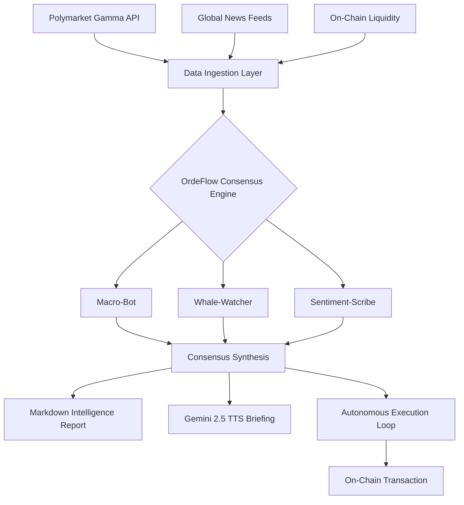

# ⚡ OrdeFlow AI: The Multi-Agent Consensus Engine for Predictive Markets

**OrdeFlow AI** is a high-performance, autonomous trading terminal designed for Polymarket. It orchestrates a "Consensus Protocol" between specialized AI agents to transform market noise into high-conviction, institutional-grade intelligence.

---

## 🚀 The Elevator Pitch
Prediction markets move at the speed of light. OrdeFlow AI removes human emotion from the equation by using a **Multi-Agent Orchestration** layer. It doesn't just "guess"; it debates. By correlating global news, on-chain liquidity, and social sentiment, it provides traders with the ultimate "Truth Machine" for predictive betting.

---

## 🌪️ The Problem
Traders on Polymarket often struggle with:
- **Information Overload:** Scanning 24/7 news feeds is impossible for humans.
- **Emotional Bias:** Fear and greed lead to poor position sizing.
- **Liquidity Blindness:** Missing "Whale" movements that signal institutional shifts.

## ✨ The Solution: The "Consensus Protocol"
OrdeFlow AI solves this by deploying three specialized agents:
1.  **Macro-Bot:** Analyzes global economic trends and Fed policy.
2.  **Whale-Watcher:** Monitors on-chain liquidity and large position swaps.
3.  **Sentiment-Scribe:** Scans social media and news for breaking alpha.

---

## 🔥 Key Features (Hackathon Edge)

### 🧠 Multi-Agent Consensus Protocol
Watch the agents "debate" in real-time. The **Internal Monologue** log shows the step-by-step reasoning before a final trade recommendation is reached.

### 🌐 Google Search Grounding
OrdeFlow AI is powered by **Gemini 3.1 Pro with Google Search Grounding**. This means every analysis is backed by real-time, live web data, ensuring the agent is aware of breaking news before it's even priced in.

### 🎙️ Audio Briefings (Gemini TTS)
Don't have time to read? Click "Audio Briefing" to hear a high-fidelity summary of the market analysis, generated instantly by **Gemini 2.5 Flash Native Audio**.

### 📈 Backtesting Engine
Replay historical Polymarket data to see how the AI would have performed. Our engine simulates past events to validate strategy alpha before you risk real capital.

### ⚖️ Kelly Criterion Position Sizing
Institutional-grade risk management. The AI calculates the optimal percentage of your bankroll to allocate to each trade using the **Kelly Criterion**, visualized directly in the report.

### 🚨 Whale Alert & Social Broadcast
Real-time detection of large on-chain movements. With one click, broadcast these alerts to your **Discord or Telegram** community to keep your followers ahead of the curve.

### 🛡️ "Why Not?" Panel
Transparency is key. The "Why Not?" panel shows signals that the AI *rejected*, explaining the specific risk factors (low confidence, poor liquidity) that led to a "Hold" decision.

### 🎚️ Risk-Adaptive Strategy
Fine-tune your bot's personality with a **1-10 Risk Slider**. From "Conservative" (liquidity-focused) to "Aggressive" (news-driven), the AI adapts its reasoning to your appetite.

---

## 🗺️ System Architecture

---

## 🖥️ Interface Walkthrough

### 1. Mission Control Dashboard
A dark-mode, high-density terminal designed for professional traders. Features live market lists, real-time performance analytics (Sharpe Ratio, Win Rate), and an interactive PnL chart.

### 2. Agent Consensus Log
A live-streaming feed of the AI's "thoughts." See the debate happen in real-time as agents correlate news with price action.

### 3. Intelligence Reports
Structured, Markdown-rendered reports that break down:
- **Consensus Sentiment Score** (-100 to 100)
- **Kelly Criterion** position sizing
- **Risk Mitigation** strategies

---

## 🛠️ Technical Stack
- **Frontend:** React 18, Vite, Tailwind CSS
- **AI Intelligence:** Gemini 3.1 Pro (Reasoning), Gemini 3 Flash (Sentiment)
- **Audio:** Gemini 2.5 Flash Native Audio (TTS)
- **Animations:** Framer Motion (`motion/react`)
- **Charts:** Recharts (Performance Analytics)
- **State Management:** React Hooks (Context-ready)

---

## 🚦 Getting Started

1.  **Clone the repo:** `git clone https://github.com/your-repo/ordeflow-ai`
2.  **Install dependencies:** `npm install`
3.  **Set Environment Variables:** Add your `GEMINI_API_KEY` to the settings.
4.  **Run the terminal:** `npm run dev`

---

## 🔮 Future Roadmap
- **Live Mainnet Execution:** Moving from simulation to real USDC swaps on Polygon.
- **Social Copy-Trading:** Follow the "Consensus" of top-performing agent configurations.
- **Multi-Modal Vision:** Feeding live charts directly into the agents for technical pattern recognition.

---

**Built with ❤️ for the AI Studio Hackathon.**
